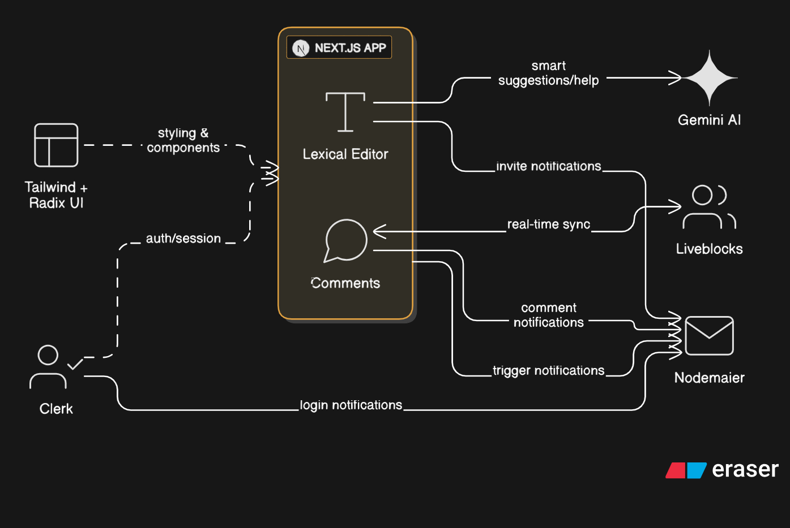

# FlowDocs 📝

<div align="center">
  
  
  <h3>Real-time Collaborative Document Editor</h3>
  <p>A modern, feature-rich collaborative document editing platform built with Next.js, Liveblocks, and AI assistance.</p>

  [](https://opensource.org/licenses/MIT)
  [](https://nextjs.org/)
  [](https://www.typescriptlang.org/)
  [](https://liveblocks.io/)
  [](CONTRIBUTING.md)

  [Live Demo](https://your-demo-url.com) • [Documentation](docs/) • [Report Bug](../../issues) • [Request Feature](../../issues)
</div>

---

## 🚀 Features

### ✨ Core Features
- **Real-time Collaboration**: Multiple users can edit documents simultaneously with live cursors and presence indicators
- **Rich Text Editor**: Powered by Lexical with advanced formatting options (bold, italic, headings, lists, etc.)
- **AI Writing Assistant**: Integrated Gemini AI for content suggestions, writing help, and document enhancement
- **Live Comments**: Real-time commenting system with threaded discussions
- **User Management**: Role-based access control (viewer, editor) with sharing permissions
- **Document Sharing**: Share documents via email with customizable access levels

### 🔧 Technical Features
- **Authentication**: Secure user authentication with Clerk
- **Real-time Sync**: Powered by Liveblocks for seamless collaboration
- **Responsive Design**: Mobile-first approach with Tailwind CSS
- **Dark/Light Theme**: Elegant themes optimized for productivity
- **Email Notifications**: Automated sharing and collaboration notifications
- **Type Safety**: Full TypeScript implementation
- **Modern UI**: Radix UI components with custom styling

### 📱 User Experience
- **Intuitive Interface**: Clean, modern design focused on productivity
- **Active Collaborators**: See who's online and where they're working
- **Document Dashboard**: Organized view of all your documents
- **Quick Actions**: Fast document creation, sharing, and management
- **Notifications**: Stay updated on document changes and collaborations

---

## 🏗️ Architecture



---

## 🛠️ Tech Stack

### Frontend
- **Framework**: [Next.js 14](https://nextjs.org/) - React framework with App Router
- **Language**: [TypeScript](https://www.typescriptlang.org/) - Type-safe JavaScript
- **Styling**: [Tailwind CSS](https://tailwindcss.com/) - Utility-first CSS framework
- **UI Components**: [Radix UI](https://www.radix-ui.com/) - Unstyled, accessible components
- **Editor**: [Lexical](https://lexical.dev/) - Extensible text editor framework

### Backend & Real-time
- **Real-time Collaboration**: [Liveblocks](https://liveblocks.io/) - Real-time collaboration infrastructure
- **Authentication**: [Clerk](https://clerk.com/) - Complete authentication solution
- **AI Integration**: [Google Gemini AI](https://ai.google.dev/) - Advanced language model
- **Email Service**: [MailerSend](https://www.mailersend.com/) - Transactional email API

### Development Tools
- **Package Manager**: npm
- **Linting**: ESLint with Next.js config
- **Code Formatting**: Built-in Next.js standards
- **Type Checking**: TypeScript compiler

---

## 🚦 Getting Started

### Prerequisites

Before running FlowDocs, ensure you have:

- **Node.js** (v18 or higher)
- **npm** or **yarn** package manager
- **Git** for version control

### Required API Keys

You'll need to obtain the following API keys:

1. **Liveblocks**: [Get API key](https://liveblocks.io/)
2. **Clerk**: [Get API key](https://clerk.com/)
3. **Google Gemini AI**: [Get API key](https://ai.google.dev/)
4. **MailerSend**: [Get API key](https://www.mailersend.com/)

### Installation

1. **Clone the repository**
   ```bash
   git clone https://github.com/SouptikTaran/FlowDocs.git
   cd FlowDocs
   ```

2. **Install dependencies**
   ```bash
   npm install
   ```

3. **Set up environment variables**
   
   Create a `.env.local` file in the root directory:
   ```env
   # Clerk Authentication
   NEXT_PUBLIC_CLERK_PUBLISHABLE_KEY=your_clerk_publishable_key
   CLERK_SECRET_KEY=your_clerk_secret_key
   NEXT_PUBLIC_CLERK_SIGN_IN_URL=/sign-in
   NEXT_PUBLIC_CLERK_SIGN_UP_URL=/sign-up

   # Liveblocks
   NEXT_PUBLIC_LIVEBLOCKS_PUBLIC_KEY=your_liveblocks_public_key
   LIVEBLOCKS_SECRET_KEY=your_liveblocks_secret_key

   # Google Gemini AI
   NEXT_PUBLIC_GEMINI_API_KEY=your_gemini_api_key

   # MailerSend
   MAILERSEND_API_KEY=your_mailersend_api_key

   # Sentry (Optional)
   SENTRY_DSN=your_sentry_dsn
   ```

4. **Run the development server**
   ```bash
   npm run dev
   ```

5. **Open your browser**
   
   Navigate to [http://localhost:3000](http://localhost:3000) to see FlowDocs in action!

---

## 📖 Usage

### Creating Documents
1. Sign up or sign in to your account
2. Click the "Add Document" button on your dashboard
3. Start writing with the rich text editor
4. Your changes are automatically saved

### Collaborating
1. Click the "Share" button in any document
2. Enter collaborator email addresses
3. Set their permission level (viewer or editor)
4. Collaborators will receive an email invitation

### Using AI Assistant
1. Click the AI assistant icon in the editor
2. Ask questions or request writing help
3. Insert AI-generated content directly into your document

### Managing Access
- **Editors**: Can modify document content and manage sharing
- **Viewers**: Can read documents and add comments
- **Owners**: Have full control over the document

---

## 🤝 Contributing

We welcome contributions from the community! Here's how you can help make FlowDocs better:

### Ways to Contribute

- 🐛 **Bug Reports**: Found a bug? [Open an issue](../../issues/new?template=bug_report.md)
- 💡 **Feature Requests**: Have an idea? [Request a feature](../../issues/new?template=feature_request.md)
- 📝 **Documentation**: Help improve our docs
- 🔧 **Code Contributions**: Submit pull requests

### Development Setup

1. **Fork** the repository
2. **Clone** your fork locally
3. **Create** a new branch for your feature
4. **Make** your changes
5. **Test** your changes thoroughly
6. **Submit** a pull request

### Contribution Guidelines

- Follow the existing code style and conventions
- Write clear, descriptive commit messages
- Add tests for new features
- Update documentation as needed
- Ensure all tests pass before submitting

For detailed contribution guidelines, see [CONTRIBUTING.md](CONTRIBUTING.md).

---

## 📁 Project Structure

```
flowdocs/
├── app/                    # Next.js App Router pages
│   ├── (auth)/            # Authentication routes
│   ├── (root)/            # Main application routes
│   └── api/               # API endpoints
├── components/            # React components
│   ├── editor/            # Editor-specific components
│   ├── ui/                # Reusable UI components
│   └── hooks/             # Custom React hooks
├── lib/                   # Utility libraries
│   └── actions/           # Server actions
├── public/                # Static assets
│   └── assets/            # Images and icons
├── styles/                # Global styles and themes
├── types/                 # TypeScript type definitions
└── config files           # Configuration files
```

---

## 🧪 Testing

### Running Tests

```bash
# Run all tests
npm test

# Run tests in watch mode
npm run test:watch

# Run tests with coverage
npm run test:coverage
```

### Testing Strategy

- **Unit Tests**: Component and utility function testing
- **Integration Tests**: API and user flow testing
- **E2E Tests**: Complete user journey testing

---

## 🚀 Deployment

### Vercel (Recommended)

1. Push your code to GitHub
2. Connect your repository to [Vercel](https://vercel.com/)
3. Add your environment variables
4. Deploy with automatic CI/CD

### Manual Deployment

```bash
# Build the application
npm run build

# Start production server
npm start
```

---

## 🗺️ Roadmap

### Upcoming Features
- [ ] **Mobile App**: Native iOS and Android applications
- [ ] **Advanced AI Features**: Document summarization, translation
- [ ] **Templates**: Pre-built document templates
- [ ] **Version History**: Document revision tracking
- [ ] **Advanced Permissions**: Team and organization management
- [ ] **Integrations**: Google Drive, Dropbox, Notion
- [ ] **Offline Support**: Work without internet connection
- [ ] **Advanced Export**: PDF, Word, Markdown export options

### Long-term Vision
- [ ] **Plugin System**: Extensible architecture for third-party plugins
- [ ] **Advanced Analytics**: Document engagement metrics
- [ ] **Multi-language Support**: Internationalization
- [ ] **Enterprise Features**: SSO, advanced security, compliance

---

## 📄 License

This project is licensed under the **MIT License** - see the [LICENSE](LICENSE) file for details.

```
MIT License

Copyright (c) 2025 FlowDocs Contributors

Permission is hereby granted, free of charge, to any person obtaining a copy
of this software and associated documentation files (the "Software"), to deal
in the Software without restriction, including without limitation the rights
to use, copy, modify, merge, publish, distribute, sublicense, and/or sell
copies of the Software, and to permit persons to whom the Software is
furnished to do so, subject to the following conditions:

The above copyright notice and this permission notice shall be included in all
copies or substantial portions of the Software.
```

---

## 🙏 Acknowledgments

Special thanks to:

- **[Liveblocks](https://liveblocks.io/)** - For providing excellent real-time collaboration infrastructure
- **[Clerk](https://clerk.com/)** - For seamless authentication solutions
- **[Lexical](https://lexical.dev/)** - For the powerful and extensible editor framework
- **[Vercel](https://vercel.com/)** - For hosting and deployment platform
- **[Next.js Team](https://nextjs.org/)** - For the amazing React framework
- **All Contributors** - For making FlowDocs better every day

---

## 📞 Support

### Getting Help

- 📖 **Documentation**: Check our [docs](docs/) for detailed guides
- 💬 **Discussions**: Join our [GitHub Discussions](../../discussions)
- 🐛 **Issues**: Report bugs via [GitHub Issues](../../issues)
- 📧 **Email**: Reach out at support@flowdocs.com

### Community

- 🌟 **Star** this repository if you find it helpful


---

<div align="center">
  <p>Made with ❤️ by the FlowDocs team</p>
  <p>
    <a href="https://github.com/SouptikTaran/FlowDocs">⭐ Star us on GitHub</a> •
    <a href="../../issues">🐛 Report Issues</a> •
    <a href="CONTRIBUTING.md">🤝 Contribute</a>
  </p>
</div>
